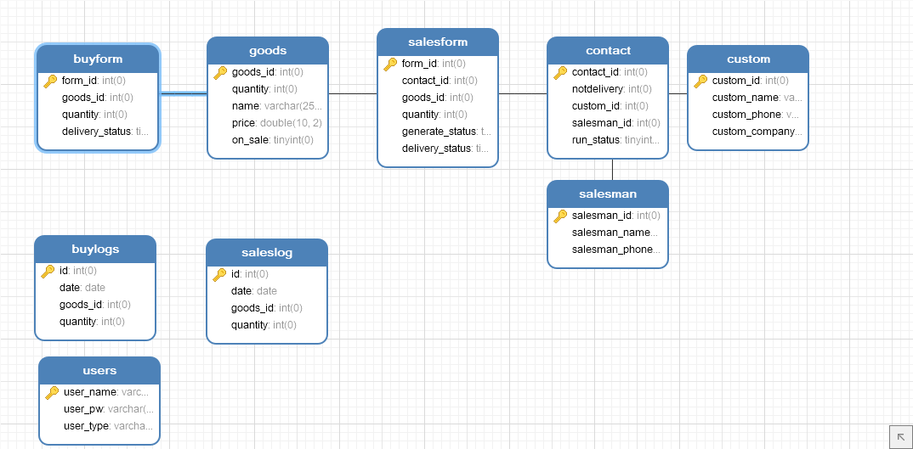
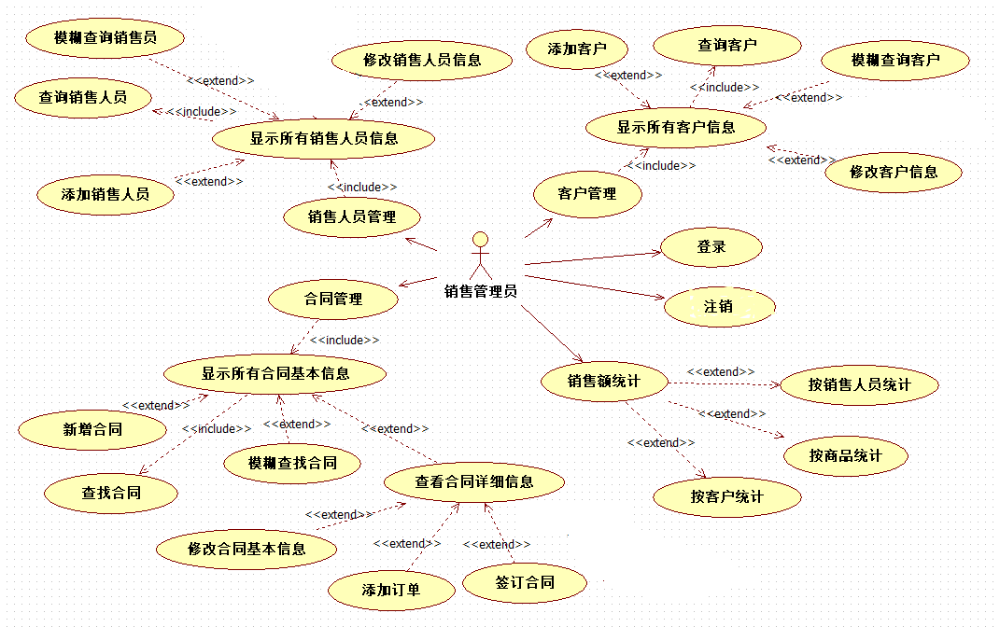
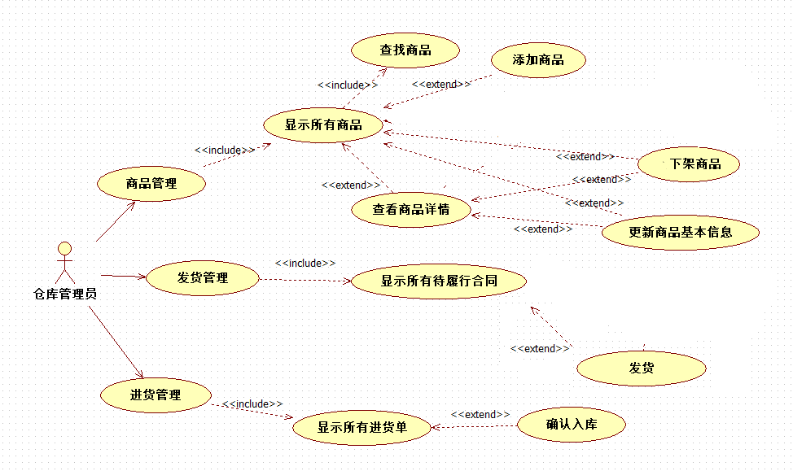
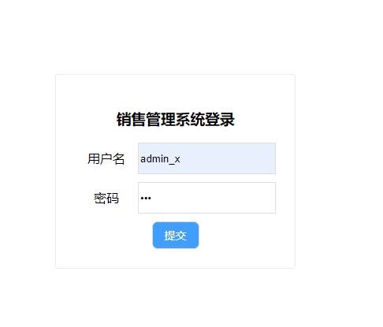
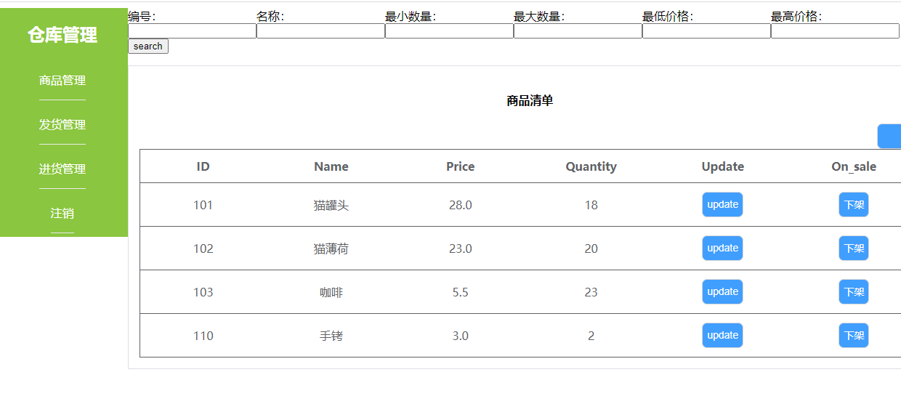

- [SSM_salesManagementSystem](#ssm-salesmanagementsystem)
    + [v0.1](#v01)
    + [v0.2](#v02)
    + [v1.0](#v10)
    + [ER图与实体类类图](#er-------)
      - [用例图](#---)
      - [登录页](#---)
      - [仓库管理员首页](#-------)
    + [一个完成度不高的实验报告](#一个完成度不高的实验报告)

<small><i><a href='http://ecotrust-canada.github.io/markdown-toc/'>Table of contents generated with markdown-toc</a></i></small>
# SSM_salesManagementSystem
ssm大作业销售管理系统
### v0.1
> goods商品类的简单增删改查，和简单的登录跳转
>待解决：添加页面从转到controller到直接从href跳转
> >Git使用
> 
> >本次提交尝试更正commit信息为中文，之前终端输入中文时commit命令未执行
>
> >以本地仓库推送远程仓库或许建立远程仓库不应建立readme.md导致出现main分支
> > pull出现分支冲突refusing to merge unrelated histories
> 
```
From github.com:SFAfreshman/SSM_salesManagementSystem
 * branch            master     -> FETCH_HEAD
 * [new branch]      master     -> origin/master
```
> >可尝试建立空仓库直接push覆盖？或者也要先pull
### v0.2
> 调整了form表单和表格的样式
> 实现了合同类的关联查询
### v1.0
> 实现了所有功能
>没有怎么接触前端的人手撸的css,丑确实挺丑的2333
### ER图与实体类类图
>

>
#### 用例图
>

>
#### 登录页
>
#### 仓库管理员首页
>
#### 一个完成度不高的实验报告
[一个完成度不高的实验报告](./res/课程实验报告.docx)
